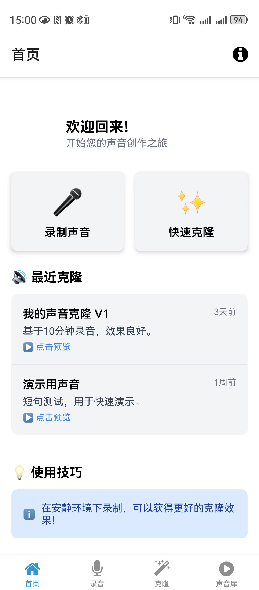
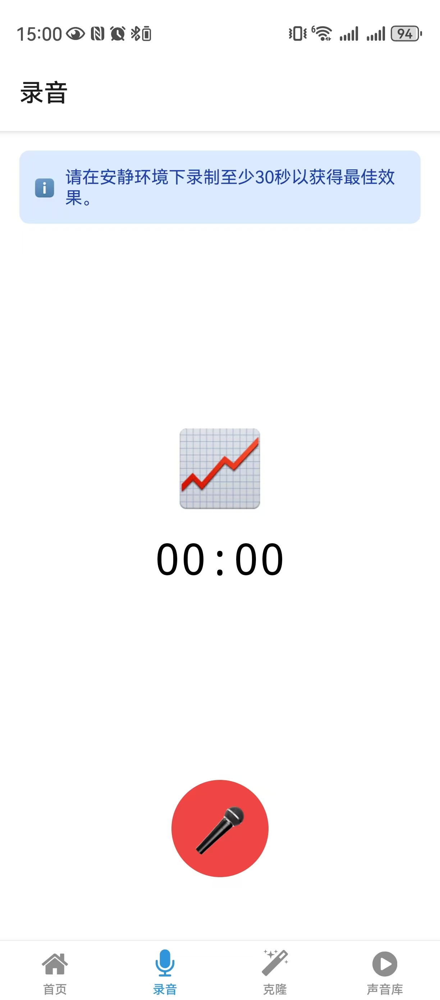
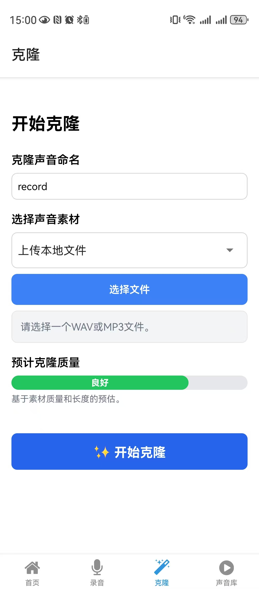
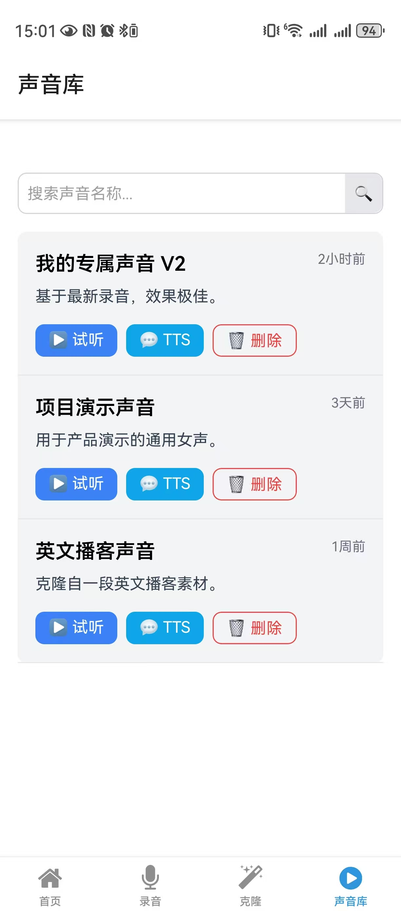

# Bangu App MVP

## 项目概述

Bangu App 是一个基于 React Native 和 Expo 开发的移动应用程序，专注于声音处理和管理。它允许用户录制声音、进行声音克隆，并管理个人声音库。

## 主要功能

- **声音录制**: 提供直观的界面进行高质量的声音录制。
- **声音克隆**: 用户可以上传或选择已录制的声音素材，通过AI技术进行声音克隆。
- **声音库管理**: 集中管理用户克隆和录制的声音，支持播放和文本转语音 (TTS) 功能。
- **主题切换**: 根据设备的主题设置，提供亮色和暗色模式支持（通过 `useColorScheme` 实现）。

## 项目结构

以下是项目主要目录和文件的简要说明：

- `app/`: Expo Router 应用程序的根目录。
  - `(tabs)/`: 定义了应用程序的底部导航栏（Tabs）。
    - `_layout.tsx`: Tabs 导航的布局和配置。
    - `index.tsx`: 对应 Tabs 导航中的主页（HomeScreen）。
    - `record.tsx`: 对应 Tabs 导航中的录音页面（RecordScreen）。
    - `clone.tsx`: 对应 Tabs 导航中的克隆页面（CloneScreen）。
    - `library.tsx`: 对应 Tabs 导航中的声音库页面（LibraryScreen）。
  - `_layout.tsx`: 应用程序的根布局，包含全局配置和导航堆栈。
  - `modal.tsx`: 模态视图的示例文件。
- `components/`: 可复用的 React Native 组件。
  - `Themed.tsx`: 提供基于主题的组件，如 `Text` 和 `View`。
  - `useColorScheme.ts`: 处理颜色方案的 Hook。
  - `useClientOnlyValue.ts`: 用于在客户端和服务器端渲染之间区分值的 Hook。
- `constants/`: 存放常量，如颜色定义。
  - `Colors.ts`: 定义应用程序的颜色主题。
- `screens/`: 应用程序的各个主要屏幕组件。
  - `HomeScreen.tsx`: 应用程序的欢迎界面和功能入口。
  - `RecordScreen.tsx`: 录音功能界面。
  - `CloneScreen.tsx`: 声音克隆功能界面。
  - `LibraryScreen.tsx`: 声音库管理界面。
- `package.json`: 项目依赖和脚本配置。
- `app.json`: Expo 项目的配置。

## 安装与运行

确保你已安装 Node.js 和 npm/yarn。

1. **克隆项目**:

    ```bash
    git clone [你的Git仓库地址]
    cd bangu-app
    ```

2. **安装依赖**:

    ```bash
    npm install
    # 或者
    yarn install
    ```

3. **运行项目**:

    ```bash
    npx expo start
    ```

    这将启动 Expo 开发服务器。你可以在终端中选择在模拟器、连接的设备或浏览器中打开应用。

## APP 截图

|  |  |  |  |
|:------------------------:|:--------------------------:|:-------------------------:|:---------------------------:|
|    Home Screen           |      Record Screen         |      Clone Screen         |     Library Screen          |
 

## 贡献

欢迎通过以下方式为本项目做出贡献：

- 提交 Bug 报告
- 提出新功能建议
- 提交 Pull Request 修复 Bug 或实现新功能

请确保你的代码符合项目规范，并在提交 PR 前进行充分测试。

## 许可证

本项目采用 [选择你的许可证，例如 MIT 或 Apache 2.0] 许可证。详情请参阅 `LICENSE` 文件（如果存在）。
